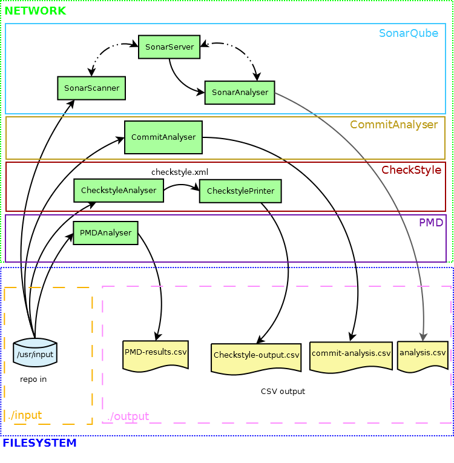

# G23 – Softa Metodit AB

Code analysis service project for Tampere University course *TIE-21107 Software Engineering Methodologies*.

## The service

One part of the project was writing the service itself.

### Project structure

The program delivered in this project is separated into multiple microservices running in separate docker containers. This makes setup and usage for users simple and quick.

The core parts of the program are the three different analysis tools, each
running their services in a few separate docker containers.

#### CommitAnalyser
- CommitAnalyser
    * Prints csv from commit information in input repository

#### SonarQube
- SonarServer
    * SonarQube server container, required for running sonar analysis tools
- SonarScanner
    * SonarQube scanner for scanning input repo
    * Uses SonarServer for the analysis and sharing results
- SonarAnalyser
    * Fetches analysis results from SonarServer and writes them into a csv-file
      for the user to read

#### Checkstyle
- CheckstyleAnalyser
    * Runs the checkstyle analysis on the input repository
- CheckstylePrinter
    * Fetches analysis results from CheckstyleAnalyser and writes into csv

#### PMD
- PMDAnalyser
    * One container runs the analysis and writes csv of the results

### Prerequisites and installation

`docker` and `docker-compose` need to be installed before running. After cloning the repository,
the service stack is started with running `docker-compose up --build -d` and waiting ~1 min.

### Running

To analyze a repository, simply run `./analyzer.sh [public git HTTP URL]`. The status can be
followed with `docker logs`. The analysis is complete when result files appear in `output`;
this depends on the size of the repository.

## The project

Another part of the project was actually practicing good project management skills.

### Issues and boards

The issue feature was used to track 3 kinds of issues:
- development issues (DI): code, architecture, documentation and testing
- user stories (US): bigger feature use cases linking development issues together
- project management (PM): meetings, communication and questions to assistants

The board feature was used parallel to issues. Every issue type had its own board with separate
lists for backlog (issues to be done in the current milestone) and ongoing (issues that were
worked on actively). Issues of next milestones were collectively on the Open list and all closed
in the Closed list. Open and Closed issues were only separable by milestone metadata.

User stories are not directly linked to single issues, but they can be recognized by task list
that's unique to user story issues. The tasks are used to keep track of user story development
without the need for bloating or obsolete labels.

### Labels

The labels feature was at first used confusingly, but at the end there were 3 types of labels:
- blue labels for board lists (DI backlog, DI ongoing etc.)
- red labels for priorities in range 1-5
- green labels for tagging issues more specifically (e.g. documentation and UI/UX)

All issues have a priority (red label) and active issues have list placement (blue label). Green
labels were used when appropriate. All labels were documented for clarity.

### Other features

Other practiced features include approximating time, assigning issues, branching, discussing
code in MRs, and using referencing (for commits and MRs) etc. Emoji replies were also in quite heavy use.
